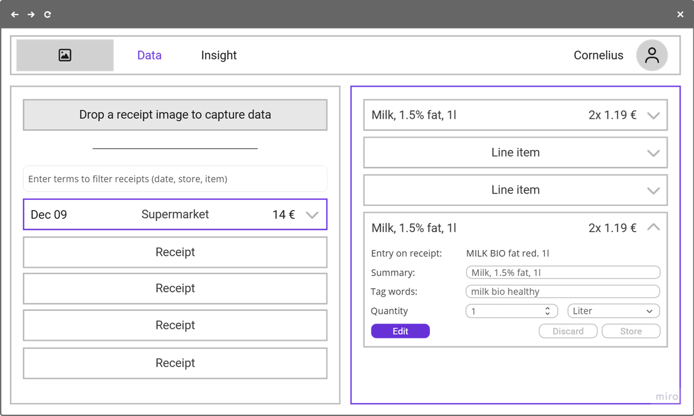
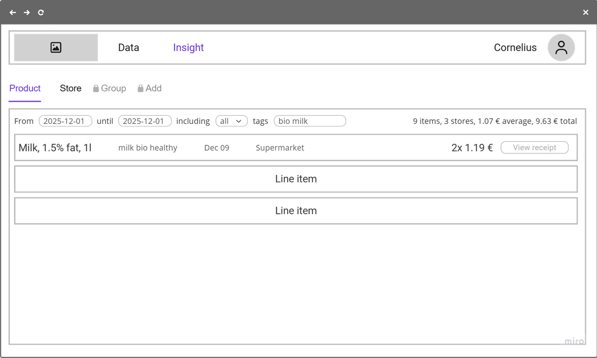
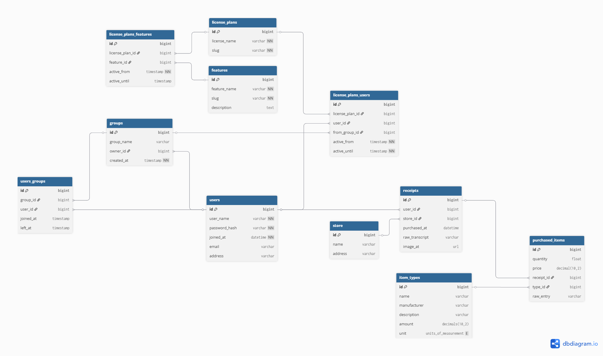

# PurchaseIQ

*Know what you buy. Change how you spend.*

## Summary

PurchaseIQ helps you understand and control your spending habits—without the busywork. Just snap a photo of any receipt or invoice, and AI instantly extracts what matters. No manual entry. No spreadsheets. No hassle.

Here's what makes PurchaseIQ different: while other apps only show *how much* you spent, PurchaseIQ shows *what* you bought. That distinction changes everything. Our Insights module reveals the patterns behind your purchases—like discovering you've spent $400 on coffee subscriptions this quarter—and lets you track the real impact when you make changes.

Upgrade to a paid subscription and share expenses and budgets with family members, or inside a small business team. Simple, efficient, effective.

See what you spend on. Spend with intention.

## What and why

### User groups and personas

#### Overview

There are distinct user groups:

- **Optimizers**: Users who actively want to improve their spending habits. They're intrinsically motivated and value detail and accuracy. This is the primary user group—keeping them engaged daily drives the data ecosystem.
- **Trackers**: Users who need to monitor specific expenses (freelancers, small business owners, families). They see tracking as a necessary chore. Speed and ease of use matter most. Secondary user group with monetization potential through a paid group tier for shared budgets.
- **Operators**: Internal users who maintain the service. Not customers, but their needs for low-cost, high-accuracy operations must shape the platform design.

Optimizers and Trackers share the same core need: control over their spending. Pen and paper would work, but it's tedious and requires discipline they don't have. They've tried and failed before. They need a system that removes friction, not adds to it.

#### The Optimizer: Maya Chen

*Age*: 29 | *Occupation*: Software Engineer | *Location*: Portland, OR

- Maya earns $115K annually but feels like money disappears without a clear reason. She's not struggling financially—she has savings and contributes to her 401(k)—but she knows she could be more intentional. She's tried budgeting apps before but abandoned them after a few weeks because manual entry felt like homework.
- What drives Maya is self-improvement. She tracks her workouts, reads personal finance blogs, and listens to podcasts about behavioral psychology. She wants to *understand* her spending patterns, not just see numbers. When she discovers she's been spending $180/month on food delivery, she wants to know: Is it mostly weeknight dinners when she's tired? Weekend brunches? Specific restaurants?
- Maya opens PurchaseIQ daily, usually during her morning coffee or evening wind-down. She photographs every receipt immediately—it's become a habit, like checking her step count. She loves the Insights module's visualizations and the dopamine hit when she sees progress toward her goals.
- Her challenge: She's detail-oriented to a fault and gets frustrated when the AI misreads items. She'll correct entries meticulously because accuracy matters to her sense of control.
- *Needs*: Precise categorization, granular insights, progress tracking, pattern recognition across time periods.
- *Motivation*: Intrinsic desire for self-mastery and financial intentionality.

#### The Tracker: James Rodriguez

*Age*: 42 | *Occupation*: Freelance Graphic Designer | *Location*: Austin, TX

- James runs a one-person design studio from home. He needs to track business expenses for tax deductions—receipt management is part of staying legally compliant, not a hobby. He hates administrative work and puts it off until tax season, which causes stress and likely costs him money in missed deductions.
- His income fluctuates between $3K-$8K monthly depending on client projects. He mixes personal and business purchases on the same credit card, then sorts them out later (or tries to). He's tried expense tracking apps but found them clunky—too many fields to fill out, too much friction when he's rushing between meetings.
- James uses PurchaseIQ pragmatically. When he buys design software, office supplies, or takes a client to lunch, he snaps a photo and tags it "business" in under 10 seconds. That's it. He doesn't check the app daily—maybe 2-3 times per week to batch-process recent purchases.
- His wife recently suggested they use it together to track household spending. He's interested in the "group tier" concept if it means shared visibility without shared login credentials—they want financial transparency without merging everything.
- *Needs*: Speed, minimal friction, clear business/personal separation, export functionality for tax prep.
- *Motivation*: Compliance and efficiency—getting administrative tasks done quickly so he can focus on billable work.

### User flow

After onboarding, users enter a habit loop: capture purchases, monitor spending, and discover insights.
Steps 1, 2, and 3.1 typically happen on mobile (ideally via native app for fast access and stable permissions). Steps 3.2–5 are preferred on desktop browsers.

1. *Onboarding*
    1. Create account
        1. Minimize time to get started
        2. Minimize friction of managing another password
    2. Accept terms and conditions
        1. Minimize time to review (for GDPR compliance)
        2. Minimize concern about misuse of sensitive data
    3. Provide personal information
        1. Minimize number of required fields
    4. Grant necessary permissions (camera, notifications)
        1. Minimize confusion across permission layers
    5. Configure reminders
        1. Minimize setup time
        2. Minimize concern about reminder fatigue
    
2. *Capture Purchases*
    1. Open camera or select existing photo
        1. Minimize setup time
    2. Photograph receipt
        1. Minimize effort for proper capture (lighting, focus, angles)
    3. *Future: Voice recording as alternative input*
    4. Submit for analysis
        1. Minimize time to completion
        2. Minimize bandwidth usage
        
3. *Monitor Spending*
    1. Receive reminder notification (optional)
        1. Minimize time to extract insight
        2. Minimize time to decide on action
    2. View dashboard
        1. Minimize time to extract insight
        2. Minimize time to decide on action
    3. Correct or enrich data
        1. Minimize need for corrections
        2. Minimize need for enrichment
        3. Minimize time to identify errors
        4. Minimize time to correct errors
        5. Minimize time to add information
        6. Minimize effort to maintain consistency (suggest existing tags)

4. *Discover Insights*
    1. Explore filters
        1. Minimize time to understand each filter
        2. Minimize time to find insight-generating filters
    2. Customize filters (optional)
        1. Minimize time to create new filters
        2. Minimize time to refine existing filters
    3. Correct or enrich data (optional)
    4. Export data (optional)
        1. Minimize time to configure export
        2. Minimize time to import into analysis tools

5. *Offboarding*
    1. Delete account
    2. Receive confirmation that all personal data is deleted

Certain features are not accessible unless there is a paid license. There is a *Buy license* step interjected into (3) and (4).

### Business Case

* Cost structure
    * Fixed costs: Effort to build and maintain the service. Low at first, will grow if customer acquisition needs attention.
    * Variable costs
        * Cost to serve a user: Operational expenses on AI > storage > server operation. 
        * Cost to acquire a user: Preferably organic and viral (e.g., kick-back when a referral enters a paid sub)
* Revenue streams  
    * Paid group tier: Share receipts and budgets
    * Paid individual tier: AI reports
    * Ads / reports: The granular data on spending behavior is highly valuable. Substantial data protection issues mus tbe solved, but there is potential for monetiziation.

Conversion funnel:
1. Land on page (total users)
2. Register account
3. Complete first receipt upload
4. Review first aggregate report
5. Convert to paid
6. Invite first other group member or add first AI report
7. 30d of active usage (active: uploaded at least 1 receipt in 5 days)

By assumption:
* If 10% of total users reach (4), the product is compelling.
* If 10% of successful users who reach (4) convert to paid in (6), there is a business potential.
* If 30% of paying users reach habitual usage at (7), there is a sustainable business.

## How and when

### Technology

The system is built from four components:

1. Web browser frontend and UI with distinct mobile and desktop usage
    * React with JavaScript
    * Material UI React library
2. *Future:* Native mobile app for fast access to camera and integration with notifications (steps 2.* and 3.1 of Optimizers and Trackers)
    * React Native for simple porting web / iOS / Android
3. Backend and API
    * Python and Django
4. 3rd party components
    * Platform to operate the backend: Render with Docker
    * Database, incl. aggregetion of data for Analyst reports (data warehouse): Postgres on Neon
    * Storage of receipt photos: AWS S3
    * AI for analysis of content: OpenAI
    * Authentication with OAuth and social login.
    * Subscription management for paid accounts (e.g. Stripe)

### User Interface

#### Structure

The app has three primary areas with sub-items as secondary structure. They map to the main [user flow](#user-flow). Also see [roadmap].(#release-roadmap).

1. Capture and Review: Data
    1. Image: Upload or capture a photo of a receipt. // Voice: Speak about a spending and add it to the database
    2. Find: Show all receipts and find one.
    3. Correct: Correct the digitization of a receipt's item.
    4. Enrich: Add information to a receipt's items.
2. Understand: Insight
    1. Store: Review pruchases by store.
    2. Product: Review purchases of a product.
    3. Group: Review purchases by buyer inside the group.
    3. Custom: Define custom filters with AI.
3. Admin: Account
    1. Individual: Manage the individual account, e.g. username and password.
    2. Group: Manage the group and its members, e.g. a family or a business.
    3. Access: Manage access to featurs, incl. subscription and payment

#### Data

#### Insight

#### Look and Feel

| Token            | Option A – Light Fintech | Option B – Premium Dark | Option C – Neutral Minimal |
|------------------|---------------------------|---------------------------|-----------------------------|
| **Primary**       | #FF8A00                  | #FF8A00                  | #FF8A00                    |
| **Secondary**     | #006CD9                  | #0D1A2D                  | #006CD9                    |
| **Background**    | #F8F9FB                  | #111827                  | #F4F4F6                    |
| **Surface**       | #FFFFFF                  | #1F2937                  | #FFFFFF                    |
| **Card**          | #F0F2F5                  | #27334A                  | #E7E9EC                    |
| **Text Primary**  | #000000                  | #FFFFFF                  | #1A1A1A                    |
| **Text Secondary**| #4A4F55                  | #D1D5DB                  | #4A4A4A                    |
| **Text Disabled** | #9AA0A6                  | #6B7280                  | #9E9E9E                    |
| **Success**       | #28A745                  | #28A745                  | #28A745                    |
| **Warning**       | #DC3545                  | #DC3545                  | #DC3545                    |

Font: [Inter](https://fonts.google.com/specimen/Inter)

### API

#### ERD

See [DBML](#appendix-dbml) for more. See [roadmap](#release-roadmap) for simplifciation (groups deferred)

#### Prompts

### Release Roadmap

#### Proof of concept

- Send locally stored receipts for AI analysis
- Store the results in a database
- Review data completeness, accuracy and precision

#### Minimal viable product (desktop only)

- Account management (individual)
- Upload receipt image
- Analyze image
- Store results
- Review, correct, enrich receipts

#### Minimal loveable product

- Mobile upload from photo roll
- Insight view (Product)
- Paid path (no implementation, but show additional features on UI and track clicks)

#### Feature Pack: Better capturing

- Persistent image storage for reference
- Mobile camera usage
- Mobile voice transcriptions
- Mobile notifications

#### Feature Pack: Better insights

- Aggregate view (product)
- Custom filters and analysis

#### Feature Pack: User Groups and shared analytics

- Join a group
- Aggregate view (buyer)

### Appendix: DBML

// Admin

Table users as u {
  id bigint [pk, increment]
  user_name varchar [unique, not null]
  password_hash varchar [not null]
  joined_at datetime [not null]
  email varchar
  address varchar
}

Table features {
  id bigint [pk, increment]
  feature_name varchar [not null] // marketing
  slug varchar [not null] // internal
  description text
}

Table license_plans {
  id bigint [pk, increment]
  license_name varchar [unique, not null] // marketing
  slug varchar [unique, not null] // internal
}

Table license_plans_features {
  id bigint [pk, increment]
  license_plan_id bigint [ref: > license_plans.id]
  feature_id bigint [ref: > features.id]
  active_from timestamp [not null]
  active_until timestamp 
}

Table license_plans_users {
  id bigint [pk, increment]
  license_plan_id bigint [ref: > license_plans.id]
  user_id bigint [ref: > users.id]
  from_group_id bigint [ref: > groups.id]
  active_from timestamp [not null]
  active_until timestamp [not null]
}

Table groups as g {
  id bigint [pk, increment]
  group_name varchar
  owner_id bigint [ref: > u.id]
  created_at timestamp [not null]
}

Table users_groups {
  id bigint [pk, increment]
  group_id bigint [ref: > g.id]
  user_id bigint [ref: > u.id]
  joined_at timestamp
  left_at timestamp
}

// Data

enum units_of_measurement {
  liter
  kg
  unit
}

Table store as s {
  id bigint [pk, increment]
  name varchar
  address varchar
}

Table receipts as r {
  id bigint [pk, increment]
  user_id bigint [ref: > u.id]
  store_id bigint [ref: > s.id]
  purchased_at datetime
  raw_transcript varchar
  image_at url
}

Table item_types as it {
  id bigint [pk, increment]
  name varchar
  manufacturer varchar
  description varchar
  amount decimals(10,2)
  unit units_of_measurement
}

Table purchased_items as pi {
  id bigint [pk, increment]
  quantity float
  price decimal(10,2)
  receipt_id bigint [ref: > r.id]
  type_id bigint [ref: > it.id]
  raw_entry varchar
}